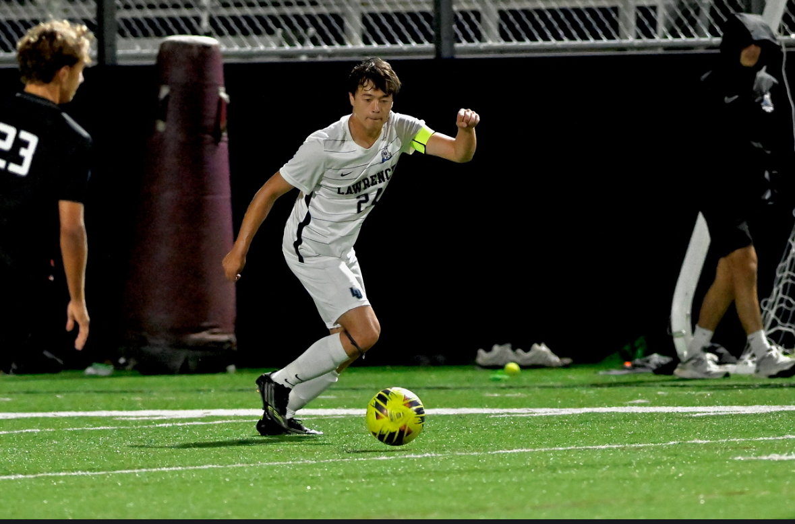
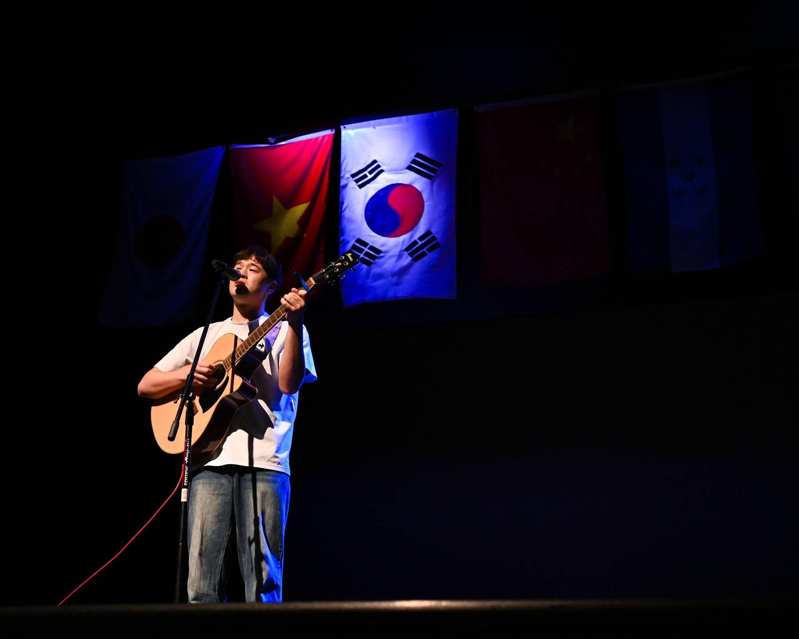
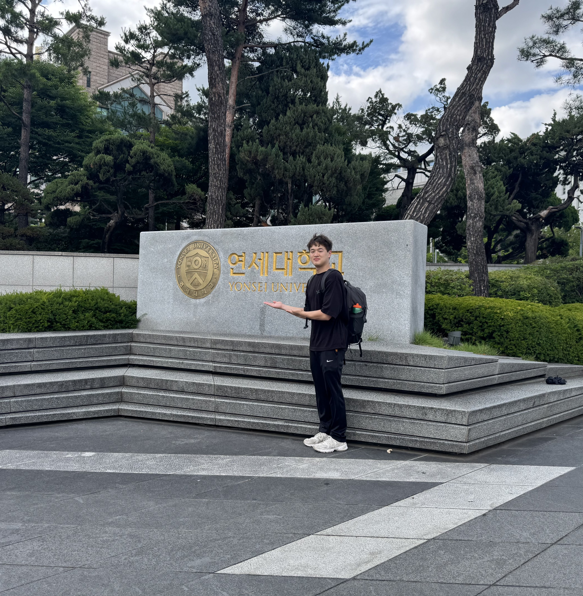

Outside of my academic work in economics, data science, and statistics, I enjoy activities that combine music, teamwork, and communication.

During my time at Lawrence University, I was the captain of the Men's Soccer team for 2 years, where I practiced and improved leadership, communication, and discipline. I also had the chance to study abroad at Yonsei University, in Seoul, South Korea, where I explored my Korean-American identity. I have continued to study Korean at an intermediate level, and learn my culture through today.

Music is also a large part of my life. I play guitar and sing, and studied vocal performance at Lawrence under Dr. Cayla Rosche, focusing in contemporary music. I love singing pop music, both in Korean and English, and I run a music account aimed at bridging these two musical genres. Through music and performance, I have realized that I greatly enjoy connecting across cultures, and expressing ideas in creative ways.

These experiences have shaped how I approach my work - through collaboration, curiosity, and an aim for clear communication.

::: {.about-photos}

:::

Thank you for reading a little bit about me!
